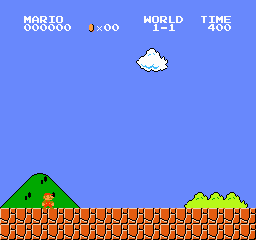
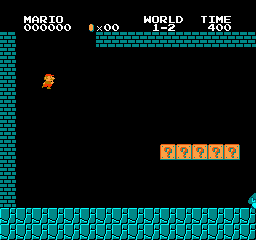
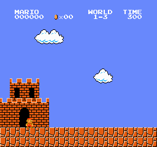

# nanoandjev-mario

验证 **Jev 与本地模型能否根据当前状态自主选择动作、完成 Mario 关卡**。模型读取 NES RAM 生成的结构化状态；每次选择都保留原始回答与实际执行记录。源自 [4esv/jev-mario](https://github.com/4esv/jev-mario)。

## 模型实测：2026-09-23

**Jev 已完成 9 局真实 API 实测，本地 Qwen2.5-1.5B 已完成 3 局真实推理实测，目前均未通关。** 所有有效模型选择原样执行，关闭 guard、自动脱困、规则兜底、教练和路线接管。此前首页展示的离线路线成功已移至[执行器回归材料](artifacts/current/README.md#离线路线回放仅用于执行器回归)，不计入模型成绩。

| 模型与模式 | 关卡 | 本次通关 | 逐局最远 x（试验顺序） | 逐局有效模型回答数 |
| --- | --- | --- | --- | --- |
| Jev `jev-latest`，纯模型决策 | 1-1 | 0/3 | 1435 / 679 / 2471 | 34 / 14 / 47 |
| Jev `jev-latest`，纯模型决策 | 1-2 | 0/3 | 198 / 655 / 960 | 9 / 24 / 36 |
| Jev `jev-latest`，纯模型决策 | 1-3 | 0/3 | 284 / 315 / 315 | 8 / 6 / 6 |
| Qwen2.5-1.5B-Instruct，纯模型决策 | 1-1 | 0/1 | 722 | 26 |
| Qwen2.5-1.5B-Instruct，纯模型决策 | 1-2 | 0/1 | 656 | 16 |
| Qwen2.5-1.5B-Instruct，纯模型决策 | 1-3 | 0/1 | 618 | 12 |

**Jev 的 184 次、本地 Qwen 的 54 次有效回答全部满足 `model_choice == executed_choice`**，`guard_rewrites=0`、`unstick_rewrites=0`。Jev 每局 API 延迟 p50 为 0.319–0.603 秒；Qwen 本地推理 p50 约 0.80–0.83 秒。样本只能建立当前配置的基线，不能证明模型永远无法通关。两者提示格式、输入 token 数和样本数不同，不把这组数字当作模型能力排行榜。未修改提示词后挑选成功样本；首轮后补测两轮，全部保留。补测两轮并发运行，延迟不是隔离性能基准。

以下各展示本轮最远的一局；完整九局包含失败录像和原始日志：

| Jev · 1-1 · x=2471 | Jev · 1-2 · x=960 | Jev · 1-3 · x=315 |
| --- | --- | --- |
|  |  |  |

证据：[汇总及每局目录](artifacts/model-eval-20260923/summary.json) · [首轮](artifacts/model-eval-20260923/jev/evaluation.json) · [第二轮](artifacts/model-eval-20260923/jev-repeat-2/evaluation.json) · [第三轮](artifacts/model-eval-20260923/jev-repeat-3/evaluation.json) · [请求响应示例](artifacts/model-eval-20260923/jev/1-1/http.jsonl) · [逐决策日志示例](artifacts/model-eval-20260923/jev/1-1/1-1-jev-20260923-103211.log.jsonl)。HTTP 记录不含认证头。

GIF 展示模拟器游戏时间，不包含等待模型的时间；模拟器在请求期间暂停。这里的“纯模型决策”指模型独立选择九种语义动作，执行器仍负责按键、跳跃落地和后退时序；不是逐帧视觉控制。

首轮失败诊断也暴露接口问题：1-1 的“距坑一格再跳”规则与每六帧决策错过了起跳窗口；1-2 低跳踩中首只敌人后碰到紧邻敌人；1-3 摘要只扫描前八格，却在第九格有断层时仍描述为前方实地。原动作诊断回放可复现这些失败，但不计为新增模型试验。后续优先修正观测范围、动作后果和重新决策时机，再验证模型收益。

另外试跑一局 Jev + guard/unstick：1-1 未通关，x=679，13 次有效回答中 guard 改写 3 次，未发生路线接管。该实验与纯模型成绩分开，见[辅助模式记录](artifacts/model-eval-20260923/jev-guarded/evaluation.json)；它不是配对消融，不能据此量化 guard 的收益。

## 本地模型实测与运行时故障

本地 Qwen 使用缓存的 **Qwen2.5-1.5B-Instruct**，revision `989aa7980e4cf806f80c7fef2b1adb7bc71aa306`；不是历史展示中的 Qwen2.5-3B。运行于 Apple M5 / 16 GiB、PyTorch 2.14.0 + Transformers 4.57.6、MPS FP16。54 次真实生成均为 `H / hop right`，即使收到 `STUCK` 提示仍重复低跳，未表现出足够的状态适应能力。

| Qwen · 1-1 · x=722 | Qwen · 1-2 · x=656 | Qwen · 1-3 · x=618 |
| --- | --- | --- |
|  |  |  |

证据：[本地评测清单](artifacts/model-eval-20260923/qwen-local/evaluation.json) · [动作、token 与录像时长审计](artifacts/model-eval-20260923/qwen-local/audit.json) · [实测脚本](artifacts/model-eval-20260923/qwen-local/run_qwen_local_eval.py)。脚本的 localhost HTTP adapter 将未改动的项目提示交给真实权重生成，未预设模型回答；不下载模型权重，依赖用独立临时环境加载。

若本机已有上述 revision 的 Hugging Face 缓存，可按执行快照重跑本地三关；这条路径独立于 Ollama：

```bash
mkdir -p output
cp artifacts/model-eval-20260923/qwen-local/run_qwen_local_eval.py output/
PYTHONPATH=. uv run --with torch==2.14.0 --with transformers==4.57.6 \
  python output/run_qwen_local_eval.py
```

脚本固定使用该权重缓存，不会自动下载；缺少权重时直接失败。本地结果的 `input_tokens=0` 表示原控制器未计本地 token，实际 token 统计见 `audit.json`，不能读成零推理成本。

另试的 `gemma4:e2b` 在 Ollama 服务中返回 HTTP 500，没有有效模型回答，属于运行时故障。日志定位为 Apple M5 / Ollama 0.24.0 的 Metal 类型编译错误；限制到 4096 上下文、设置 `num_gpu=0` 后的两次最小请求仍失败。见[原始错误](artifacts/model-eval-20260923/local-service-errors/evaluation.json)与[恢复证据](artifacts/model-eval-20260923/local-recovery/recovery-report.json)。不把该故障计作模型游戏失败，也未归因为未经证实的内存不足。

## 在线分支试演

本次还重新运行了原始 `branch.py --bot jev --level 1-1`：**未通关，x=2370，22 次真实 Jev 请求，总耗时 27.38 分钟**。

| 实际执行帧 | 候选试演帧 | 自动 escape | 自动 ride 续招 | API 延迟 p50 |
| ---: | ---: | ---: | ---: | ---: |
| 2544 | 1,574,417 | 0 | 11 | 0.624 s |


[结果清单](artifacts/model-eval-20260923/branch-jev/evaluation.json) · [22 次请求响应](artifacts/model-eval-20260923/branch-jev/http.jsonl) · [动作与续招日志](artifacts/model-eval-20260923/branch-jev/1-1-branch-jev-20260923-110044.log.jsonl)。GIF 展示 42.4 秒游戏过程；候选试演消耗的时间没有放进游戏录像。

这条路径在每个决策点现场模拟候选后果，再让 Jev 选择，没有载入预先通关路线。但它有额外复合动作、模拟器搜索和自动续招，不能与九动作的纯模型模式当作只差一个变量的实验。此次额外模拟量约为实际执行帧的 619 倍，说明工具计算预算也必须计入 agent 的整体效率。仪表代码只记录 HTTP、区分执行/模拟帧并修正 GIF 延时单位，未改变 `branch.py` 的选择与执行逻辑。

## 复现纯模型评测

```bash
git clone https://github.com/kayky233/nanoandjev-mario.git
cd nanoandjev-mario
uv sync --frozen
cp .env.example .env
```

在 `.env` 中填写 `TYPESAFE_API_KEY`，再运行：

```bash
uv run python play_local.py --bot jev --model-only --level 1-1
uv run python play_local.py --bot jev --model-only --level 1-2
uv run python play_local.py --bot jev --model-only --level 1-3
```

本地模型需要单独部署 OpenAI 兼容推理服务。以 Ollama 地址为例，设置服务中实际存在的模型名；仓库不包含权重：

```dotenv
LOCAL_POLICY_BASE_URL=http://127.0.0.1:11434/v1
LOCAL_POLICY_API_KEY=local
LOCAL_POLICY_MODEL=gemma4:e2b
LOCAL_POLICY_MODE=chat
LOCAL_POLICY_TIMEOUT=60
NO_PROXY=127.0.0.1,localhost
```

```bash
uv run python play_local.py --bot local --model-only --level 1-1
uv run python -m unittest discover -s tests -p 'test_model_only.py' -v
```

`--model-only` 只允许 `jev` / `local`，禁止与 replay、rules、dump 混用；非法回答或请求失败会保存错误结果并非零退出。每局保存 `runs/results.jsonl`、逐决策日志和有实际画面时的 GIF。检查 `status`、`flag`、`model_only`、`model_choice` 与 `executed_choice`；`api_calls` 目前统计有效返回，不包含失败请求，HTTP 失败需要单独计数。

本轮运行环境：macOS / Apple Silicon、Python 3.12.10、`gym-super-mario-bros 7.4.0`、`nes-py 8.2.1`、`gym 0.26.2`、`numpy 1.26.4`。依赖版本、源码 SHA-256、模型名称和时间保存在评测清单中。`jev-latest` 是服务端别名，服务未返回固定权重版本。

## 双栏实时观战

左栏运行本地 Qwen，右栏运行官方 Jev。两边使用独立模拟器，各自等待模型回答，展示真实画面、模型选择、实际动作、延迟、请求次数和最远距离。失败后自动重试；`--stay-on-level` 让通关的一栏停留在成功画面。观战重试不计入上方固定样本的基准结果。

先启动本地推理服务。以下命令复用已缓存的 Qwen2.5-1.5B-Instruct 权重（revision 见上文），不会下载权重；PyTorch 和 Transformers 为可选依赖：

```bash
uv run --script serve_qwen.py --port 11503
```

可用 `--model-path /path/to/model` 指定相同模型的完整本地权重目录。该实验适配器绑定 localhost，在 Apple Silicon 上使用 MPS FP16，其他环境回退 CPU；行内部署方案见[分析报告](JEV_REPORT.md)。

在另一个终端配置本地接口，并通过环境变量提供自己的 Jev 凭据，然后启动两栏：

```bash
export LOCAL_POLICY_BASE_URL=http://127.0.0.1:11503/v1
export LOCAL_POLICY_MODEL=Qwen2.5-1.5B-Instruct
export LOCAL_POLICY_MODE=chat
export NO_PROXY=127.0.0.1,localhost
# TYPESAFE_API_KEY 由自己的凭据管理方式注入进程环境。
uv run python watch_local.py --model dual --model-only --stay-on-level --level 1-1
```

打开 <http://127.0.0.1:8123/>。`--model-only` 关闭路线接管、guard、自动脱困、教练和规则兜底；模型服务异常时该栏停止并显示错误。推理服务需保持运行。

画面推流独立限为每路最高 10 fps，JPEG 质量为 60，状态每秒刷新；切到后台的标签页会断开画面流并暂停状态轮询，返回页面后恢复。这些设置只影响观战传输，不改变模型决策、模拟器帧数或执行时序。每增加一个观众都会增加出口流量。

需要进程看护时，可将最后一行替换为：

```bash
uv run python supervise.py --model dual --model-only --stay-on-level --level 1-1 --tunnel none
```

需要公网只读观战时，在已配置 ngrok 的机器上单独运行 `ngrok http http://127.0.0.1:8123`，或将看护脚本的 `--tunnel none` 改为 `--tunnel ngrok`。临时地址由隧道运行时生成，不写入仓库；电脑与两个模型服务需要持续运行。

ngrok 报 `ERR_NGROK_725` 表示账号带宽额度耗尽，重启同一账号隧道不能恢复额度。本机地址仍可使用；也可在安装 `cloudflared` 后运行 `cloudflared tunnel --url http://127.0.0.1:8123` 创建临时演示地址，或将看护参数改为 `--tunnel cloudflared`。公共演示地址的可用性仍取决于所用隧道服务。

## 模式与实现

| 入口 | 模型的职责 | 额外控制能力 |
| --- | --- | --- |
| [play_local.py](play_local.py) `--model-only` | 根据当前 RAM 状态选择动作 | 语义动作执行器；无规则改写或路线 |
| [play_local.py](play_local.py)，默认模式 | 提出动作 | guard / unstick 可改写；需检查来源 |
| [branch.py](branch.py) `--bot jev` | 根据当前候选试演后果选择动作 | 在线模拟器搜索、escape、ride |
| [live.py](live.py) | 模拟器持续运行时给出动作与风险判断 | 请求延迟进入控制闭环 |
| [watch_local.py](watch_local.py) `--model-only` | 双通道真实模型观战 | 无规则改写、教练或路线接管；默认模式保留混合策略 |
| [serve_qwen.py](serve_qwen.py) | 加载本地缓存 Qwen 权重并真实生成 | localhost OpenAI 兼容接口，独立启动 |
| [supervise.py](supervise.py) | 看护观战进程与可选隧道 | 透传纯模型模式；退出时回收子进程与锁 |

在线分支实验命令：

```bash
uv run python branch.py --bot jev --level 1-1
```

## 历史证据与参考

原仓库的三张上游 GIF 对应 **1-1、2-1、3-1** 的历史 `branch-jev`；2-1、3-1 使用早期动作集。原本地 Qwen 的 1-1 成功记录缺少逐决策来源，旧合成面板还使用了位置插值和预设动作文字。这些材料保留在[录像索引](artifacts/current/README.md)，不充当本次模型验收。

- [历史运行摘要](runs/results.jsonl)：跨版本留存结果，不能汇总为同配置成功率。
- [上游实现](https://github.com/4esv/jev-mario)：直接控制、分支试演和实时控制三种设计。
- [Laya](https://github.com/NandhaKishorM/laya)：本地 `choice / score / noul` 决策接口参考；本仓库尚未接入或实测其推理能力。
- [分析报告](JEV_REPORT.md)：当前证据、Laya 参考、agent 业务收益与行内部署方案。
- [实现与验证说明](IMPLEMENTATION.md)：模块划分、运行命令与执行器回归边界。
