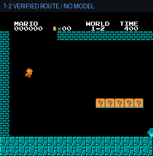
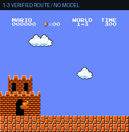

# nanoandjev-mario

基于 NES 模拟器的 Mario agent 实验：读取 RAM 生成结构化状态，通过规则、本地模型或 [TypeSafe Jev](https://typesafe.ai) 选择动作，结合分支搜索、危险动作拦截和路线回放验证执行结果。源自 [4esv/jev-mario](https://github.com/4esv/jev-mario)。

## 我们验证的结果

**2026-09-20 本地验收：1-2、1-3 均重复两次通关，模型请求数均为 0。** 两段动图来自真实模拟器的验证路线回放，画面顶部标有 `VERIFIED ROUTE / NO MODEL`。

| 1-2 · 23 步路线 | 1-3 · 26 步路线 |
| --- | --- |
|  |  |

| 关卡 | 重复验收 | 通关标志 | 最远 x | 实际模拟器帧 | 游戏时长 | 模型请求 |
| --- | --- | --- | ---: | ---: | ---: | ---: |
| 1-2 | 2/2 成功 | `flag=true` | 3161 | 2300 | 38.33 秒 | 0 |
| 1-3 | 2/2 成功 | `flag=true` | 2425 | 2430 | 40.50 秒 | 0 |

证据：[验收 JSON](artifacts/current/offline-acceptance.json) · [录像来源与说明](artifacts/current/README.md)。每次记录均为 `route_complete=true`，决策来源为 `offline_replay`；同一关卡两次的距离、帧数一致。通关以模拟器的 `flag_get` 为准，各关卡的旗杆位置不同。

帧数统计真实 `env.step()` 次数。GIF 按模拟器 60 fps 的时间线抽样为 10 fps，结尾另停留 1.5 秒。旧版 1-2 记录的 2352 包含调度对齐，实际执行为 2300 帧。

> **能力边界：这些结果证明模拟器搜索、路线时序和回放执行器可以重复通关，不代表 Jev 或本地模型自主通关。** 1-2 使用已有验证路线；1-3 由 `branch.py --bot search` 找到路线，再交给本地扩展 viewer 回放。当前未验证 1-3 纯模型自主通关、1-4 及后续连续推进。

## 验收范围与版本

本次验收在 macOS、Python 3.12.10 上完成，使用 `gym-super-mario-bros 7.4.0`、`nes-py 8.2.1`、`gym 0.26.2`、`numpy 1.26.4`。当时本地扩展版的 23 项测试通过，覆盖路线回放、真实帧计数、模型失败来源、进程回收和终态画面推流。

**本次首页更新发布文档、GIF 和验收 JSON；离线回放扩展代码及测试尚未同步到主分支。** 验收使用的 `verify_routes.py`、`--replay-only` 和 viewer 的 1-3 路线属于该本地扩展版，不能直接在当前主分支使用。下面列出主分支已有的实验入口。

## 运行主分支实验

先安装 [uv](https://docs.astral.sh/uv/)，再准备锁定依赖：

```bash
git clone https://github.com/kayky233/nanoandjev-mario.git
cd nanoandjev-mario
uv sync --frozen
```

不依赖模型服务的分支搜索：

```bash
uv run python branch.py --bot search --level 1-3
```

搜索会在模拟器快照上试演候选动作和后续动作，耗时包含未展示在录像里的探索过程。首页动图只展示已验证路线的执行时间。

接入模型前，将 `.env.example` 复制为 `.env` 并配置服务。官方 Jev 使用 `TYPESAFE_API_KEY`；本地模型需要独立运行 OpenAI 兼容服务，地址由 `LOCAL_POLICY_BASE_URL` 指定。仓库不包含模型权重。

```bash
cp .env.example .env
# 编辑 .env 后，按需运行：
uv run python branch.py --bot jev --level 1-1
uv run python play_local.py --bot local --level 1-1
uv run python watch_local.py --level 1-1 --model local
```

观战地址为 <http://127.0.0.1:8123/>。Jev 命令会请求远程 API；教练、网页检索是独立的可选服务，需分别配置。观战页出现规则兜底或路线接管时，应结合决策来源判断模型是否实际参与执行，不能仅凭通关画面判断。

## 实现方式

| 模块 | 职责 |
| --- | --- |
| [play.py](play.py) | RAM → 网格和特征，规则策略与 Jev 直接动作选择 |
| [branch.py](branch.py) | 快照试演候选及后续动作；支持 Jev 选择或离线搜索 |
| [live.py](live.py) | 模拟器不停顿，将请求延迟纳入控制实验 |
| [play_local.py](play_local.py) | 本地模型接口、危险动作拦截、脱困和教练计划 |
| [watch_local.py](watch_local.py) | 双通道观战、决策状态、失败教训和恢复路线 |
| [supervise.py](supervise.py) | 观战进程看护与可选隧道 |

模型接收结构化状态或候选试演结果；物理预测来自模拟器，最终按键与帧时序由执行器落实。分支搜索、guard 和路线接管的贡献需要与模型选择分别衡量。

## 历史结果与参考

首页原来的三张 GIF 对应上游的 **1-1、2-1、3-1** 历史 `branch-jev` 结果，其中 2-1、3-1 使用早期动作集。它们不属于上表的本次验收。

- 上游实现与实验记录：[4esv/jev-mario](https://github.com/4esv/jev-mario)。
- 历史运行数据：[runs/results.jsonl](runs/results.jsonl)。
- 历史双模型录像：[artifacts/current](artifacts/current/README.md)，与新的离线验收录像分开标记。
- 本地决策模型参考：[Laya](https://github.com/NandhaKishorM/laya)，提供 `choice / score / noul`；本仓库尚未接入或验证其模型推理。
